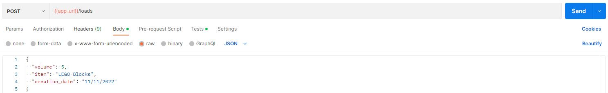
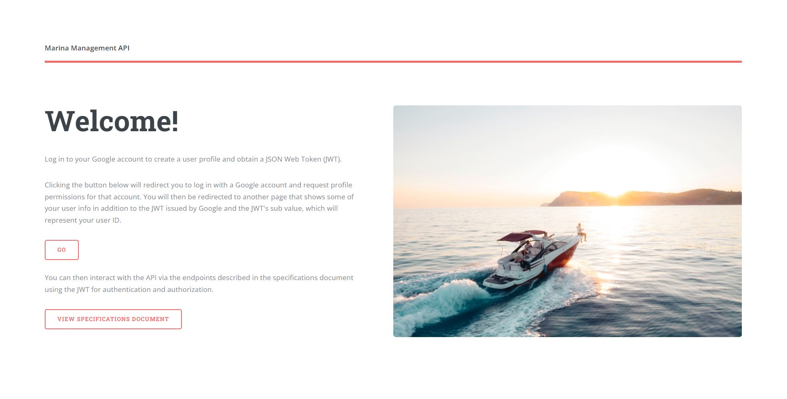
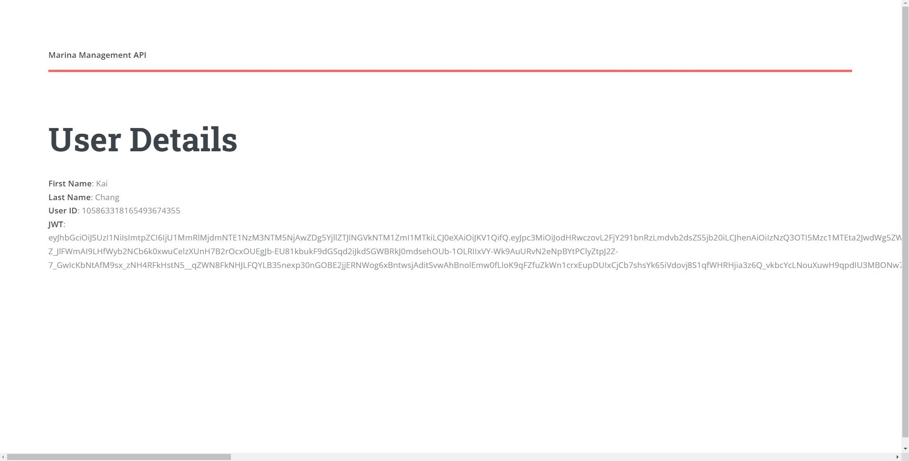
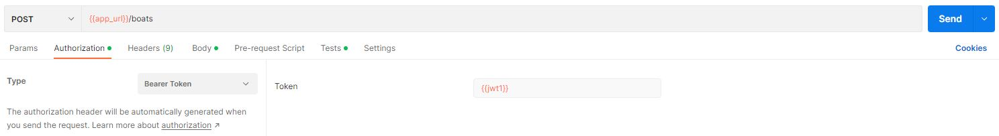

# Marina Management API

Cloud-based REST API for managing a marina.

Application URL: https://marina-management-api.wl.r.appspot.com

## API Specification

For details about the API and all supported endpoints, view the API documentation [here](https://marina-management-api.wl.r.appspot.com/api-specification.pdf).

## Getting Started

### Unprotected Endpoints

To interact with unprotected endpoints, simply send requests as described in the API Specifications.

An example request to create a load entity. The example uses Postman to send the request, although you are free to use another method.

### Protected Endpoints

Requests to protected endpoints must contain an Authorization Header with a Bearer Token. The value of the token should be a JWT that authenticates you. The JWT can be obtained from our app homepage after logging in.

Click the "Go" button to obtain a JWT.

Save the JWT and send it in the Authorization Header as the value of a Bearer Token for all requests to protected endpoints.

In the example above, the JWT is stored as an environment variable named `jwt1`. The Authorization Header type is set to "Bearer Token" with the token value set to the JWT.

Note that JWTs expire. To obtain a new JWT, simply follow these instructions again.
